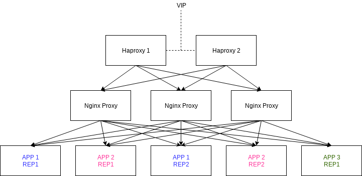
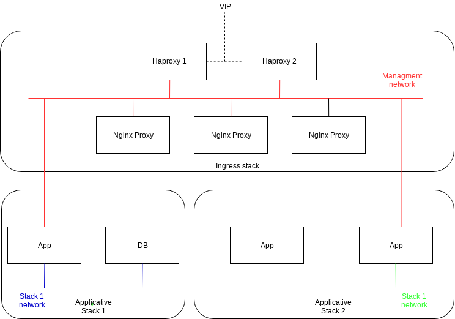

# My servers configurations

  

## Summary
- [I/ Presentation of the project](#presentation)
- [II/ Deploy on production](#production)
- [III/ Tests with vagrant](#tests)
- [IV/ Future evolutions](#todos)

## I/ Presentation of the project

### Introduction

This project was born after an internship during which I worked as an engineer project.
During this internship I had the opportunity to discover a large number of tools which pleased me and that is why 
I decided to realize a simple architecture which would allow me to deploy them, have fun and also train me on every
technology of the ecosystem.

### Aimed architecture

The evolution of the IT world makes that more and more companies meet needs for suppleness in the deployment of application.
I thus stood out constraints to make a project closer to the real world.
The first constraint that I stood out was to set up the high availability application level.
It was thus necessary to duplicates machines to avoid any break of service if a machine came to fall.

The most basic and most traditional architecture which I would have been able to choose and the implementation 
is the us of a haproxy in front of two clones servers. 
This solution showed these ability but it did not please me, indeed I wanted to test the solutions of clustering 
but especially I wanted more agile architecture, which would have the possibility of evolving more easily according 
to the future needs in load.

There are several solutions to realize application clusters. 
I was especially interested in two solutions which are: Kubernetes and Docker Swarm. 
These two solutions more interested me that the others for the simple and good reason than I wanted to containerize my applications. 
The fact to containerize the applications allows to keep a clean host of any installation (except docker), 
the application is isolated and does not depend anymore on the operating system of the host. 
The containerisation also allows the migration of an application version to an other one with no problem at all.

The solution which I held contrary to all expectations is Swarm.
The implementation of the cluster Kubernetes can be very fastidious, yet the purpose of my first project is to test the ecosystem,
I preferred to make an a little less good choice on the architectural side to be able to dedicate me to the real problem.

Here is the current application architecture of the cluster that I organized to assure the redundancy.

  

Every brick is a service answered in the cluster. Certain managers of the cluster are tagged has haproxies. 
These haproxies possess a VIP attributed thanks to Keepalived (which at the moment is hard settled on machines. 
This will evolve certainly in the next updates).
Haproxy possesses a dynamic configuration which allows to discover automatically all the nginx pods
(this is possible thanks to the sharing of sock docker in containers, it is the main reason which made that haproxys nodes are managers).
 Finally the nginx nodes manages to communicate with the other services thanks to a global network docker.
 This network is managed by swarm, it makes itself the load balancing in mode round Robin.

Here is a network more directed networks to understand better the functioning explained above.

  

### Spread services

TODO

### Used tools for deployment

TODO

## II/ Deploy on production

### Prerequisites
- [Ansible](https://www.ansible.com/)
- [Machines accessible via ssh](docs/install-ssh.md)

### Before provisioning
- [1) Create your credential file](docs/my-credentials.md)
- [2) Update Ansible inventory](docs/update-ansible-inventory.md)

### Launch provisioning
- [Launch provisioning with Ansible](docs/run-swarm-services-with-ansible.md)

## III/ Tests with vagrant

### Prerequisites
- [Virtualbox](https://www.virtualbox.org/)
- [Vagrant](https://www.vagrantup.com/)
- [Ansible](https://www.ansible.com/)

### Before test
- [1) Create your credential file](docs/my-credentials.md)
- [2) Configure DNS](docs/dns-configuration.md)

### Launch test
[Launch test with vagrant](docs/launch-vm.md)
 
<b>Notes:</b>
- Your computer needs at least 16Go ram

## IV/ Future evolutions
- [TODOS](TODO.md)
